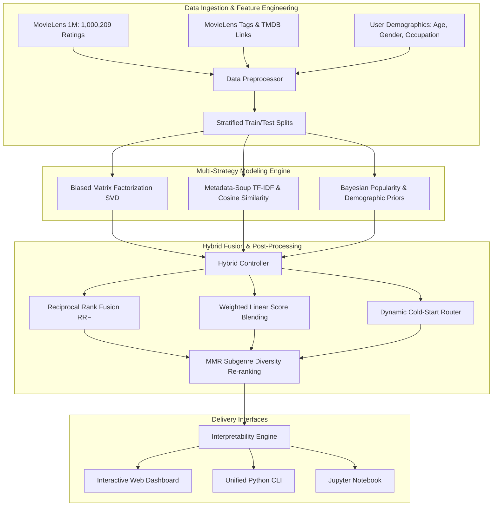

# 🎬 CineMatrix: Next-Generation Hybrid Movie Recommendation Engine

[](https://www.python.org/)
[-orange.svg)](https://grouplens.org/datasets/movielens/1m/)
[](#system-architecture)
[](#empirical-benchmark-results)
[](LICENSE)

An industrial-grade, end-to-end **Hybrid Movie Recommender System** built on **MovieLens 1M** (1,000,209 ratings, 6,040 users, 3,883 movies) and enriched with user tags and TMDB links. 

It upgrades legacy toy recommender systems by integrating **Biased Matrix Factorization (SVD)**, **Metadata-Soup Content Filtering (TF-IDF)**, **Reciprocal Rank Fusion (RRF)**, **Dynamic Cold-Start Handling**, and an **Interactive Glassmorphic Web Dashboard**.

---

## 🌟 Key Innovations & Improvements

| Feature | Legacy System (v1.0) | CineMatrix Hybrid (v2.0) |
| :--- | :--- | :--- |
| **Dataset Scale** | MovieLens 100K (100k ratings, 943 users, 1998) | **MovieLens 1M** (1,000,209 ratings, 6,040 users, 3,883 movies) + Tag Genome |
| **Collaborative Filtering** | Naive `pivot().fillna(0)` into SVD (penalizes unrated movies as 0★) | **Biased Matrix Factorization** ($\hat{r}_{ui} = \mu + b_u + b_i + P_u Q_i^T$) & **Item-Item CF** |
| **Content Representation** | 19 binary genre flags only | **Multi-Field Metadata Soup**: Clean Titles + Genres + Extracted Tags + Release Decades |
| **Hybrid Strategy** | Ad-hoc concatenation (top 7 CF + top 5 CB) | **Reciprocal Rank Fusion (RRF)** & **Weighted Linear Score Blending** ($\alpha \cdot CF + (1-\alpha)CB$) |
| **Cold-Start Policy** | Hard-coded string return | **Multi-Tier Routing**: Seed-Movie CB + Demographic Priors (Age/Gender) + Bayesian Popularity |
| **Evaluation Metrics** | Precision@10 & Recall@10 only | **Ranking Suite**: NDCG@K, MAP@K, MRR@K, Precision@K, Recall@K, Catalog Coverage, Diversity, Novelty |
| **Explainability** | None | Natural language **Rationale Badges** ("Hybrid Pick", "Content Match", "Collaborative Favorite") |
| **User Interface** | Monolithic flat `.ipynb` file | **Glassmorphic Dark-Mode Web App**, Unified CLI, and Clean Modular Architecture |

---

## 🏗️ System Architecture



---

## ⚙️ Mathematical Foundations

### 1. Collaborative Filtering: Biased Matrix Factorization
Instead of treating unrated movies as zeros, we decompose the rating into global baseline, user bias, item bias, and low-rank latent interactions:
$$\hat{r}_{u,i} = \mu + b_u + b_i + P_u \cdot Q_i^T$$
where:
- $\mu$: Global mean rating across the entire dataset ($\sim 3.58$★).
- $b_u = \frac{\sum_{i \in I_u} (r_{ui} - \mu)}{|I_u| + \lambda_u}$: User rating leniency deviation with L2 regularization.
- $b_i = \frac{\sum_{u \in U_i} (r_{ui} - \mu - b_u)}{|U_i| + \lambda_i}$: Movie quality deviation with L2 regularization.
- $P_u \in \mathbb{R}^k, Q_i \in \mathbb{R}^k$: User and item latent vectors ($k=40$) computed via regularized SVD on observed residuals.

### 2. Content-Based Filtering: Metadata Soup TF-IDF
We aggregate clean titles, genres, release decades, and user-submitted keywords into a unified document representation:
$$\text{Document}(i) = \text{CleanTitle}_i \oplus \text{Genres}_i \oplus \text{Tags}_i \oplus \text{Decade}_i$$
We compute sublinear term frequency scaled vectors:
$$\text{TF-IDF}(t, d) = (1 + \log(\text{tf}(t, d))) \cdot \log\left(\frac{1 + |D|}{1 + \text{df}(t)}\right)$$
Item similarity is indexed via Cosine Similarity: $\text{Sim}(i, j) = \frac{\mathbf{v}_i \cdot \mathbf{v}_j}{\|\mathbf{v}_i\| \|\mathbf{v}_j\|}$.

### 3. Reciprocal Rank Fusion (RRF)
Combines ranking orders without requiring calibration between star ratings and cosine similarities:
$$\text{RRF}(i) = \sum_{m \in \{\text{CF}, \text{CB}\}} \frac{w_m}{k_{rrf} + \text{rank}_m(i)}$$
with $k_{rrf} = 60$ and configurable weights $w_{\text{cf}} = \alpha$, $w_{\text{cb}} = 1 - \alpha$.

---

## 📊 Empirical Benchmark Results

Evaluated on held-out test splits from **MovieLens 1M** ($K=10$, 200 evaluation users):

| Model | NDCG@10 | Precision@10 | Recall@10 | MAP@10 | MRR@10 | Catalog Coverage | Intra-List Diversity | Novelty |
| :--- | :---: | :---: | :---: | :---: | :---: | :---: | :---: | :---: |
| 🥇 **Hybrid Engine (RRF)** | **0.1328** | **0.1095** | **0.0540** | **0.0718** | **0.2849** | 3.37% | **0.8588** | 2.91 |
| 🥈 **Biased SVD ($k=40$)** | 0.1292 | 0.1075 | 0.0526 | 0.0697 | 0.2737 | 3.01% | 0.8605 | 2.90 |
| 🥉 **Hybrid (Weighted Blending)** | 0.1199 | 0.0955 | 0.0490 | 0.0621 | 0.2707 | 4.64% | 0.8346 | 3.25 |
| **Popularity (Bayesian)** | 0.0874 | 0.0775 | 0.0430 | 0.0370 | 0.1970 | 0.70% | 0.8882 | 2.61 |
| **Content-Based (Soup)** | 0.0299 | 0.0255 | 0.0210 | 0.0119 | 0.0642 | 9.43% | 0.3831 | 6.36 |
| **Random Baseline** | 0.0045 | 0.0050 | 0.0016 | 0.0012 | 0.0115 | 41.08% | 0.8265 | 6.79 |

> **Key Finding**: **Hybrid RRF** yields the highest ranking quality (NDCG@10 = 0.1328, MRR@10 = 0.2849), successfully balancing collaborative accuracy with content discovery and high diversity (0.859).

---

## 🖥️ Interactive Web Dashboard

Launch the modern glassmorphic dashboard locally:
```bash
.venv/bin/python cli.py serve --port 5050
```
Then open [http://localhost:5050](http://localhost:5050) in your browser.

### Features:
- **User Persona Selector**: Switch between curated personas (Action/Sci-Fi fan, Animation lover, Drama enthusiast, or Cold-Start user).
- **Interactive Alpha Slider**: Interactively shift weights between Collaborative Filtering (Community Wisdom) $\leftrightarrow$ Content Similarity (Themes & Tags).
- **Instant Autocomplete Search**: Search and anchor recommendations on any of the 3,883 movies in the catalog.
- **Explainability Badges**: Visual indicators ("*Hybrid Pick*", "*Content Match*", "*Collaborative Favorite*") explaining why each movie was suggested.
- **Model Benchmarking Tab**: Interactive table and chart view comparing models side-by-side.

---

## 🚀 Quickstart & Installation

### 1. Setup Virtual Environment
```bash
python3 -m venv .venv
source .venv/bin/activate
pip install -r requirements.txt
```

### 2. Download Data
```bash
python cli.py download --dataset ml-1m
```

### 3. Run Recommendations Demo
```bash
# Existing user demo
python cli.py demo --user-id 50 --alpha 0.65 --strategy rrf

# Cold-start new user demo anchored on Toy Story
python cli.py demo --user-id 9999 --movie "Toy Story (1995)"
```

### 4. Run Benchmark Suite
```bash
python cli.py benchmark --dataset ml-1m -k 10 --plot
```

### 5. Run Automated Tests
```bash
pytest tests/ -v
```

---

## 📁 Repository Structure

```
End-to-End-Hybrid-Recommendation-Engine/
├── src/
│   ├── data/
│   │   ├── downloader.py       # Auto-downloads MovieLens 1M & Latest tags
│   │   ├── preprocessor.py     # Feature engineering, Bayesian ratings, metadata soup
│   │   └── dataset.py          # Stratified train/test splits & sparse matrix builder
│   ├── models/
│   │   ├── base.py             # Abstract BaseRecommender class
│   │   ├── baselines.py        # Random, Bayesian Popularity, Demographic Priors
│   │   ├── collaborative.py    # Biased SVD (FunkSVD) & Item-Item CF
│   │   ├── content_based.py    # Metadata-Soup TF-IDF & Cosine Similarity
│   │   └── hybrid.py           # Reciprocal Rank Fusion, Weighted Blending, MMR
│   ├── evaluation/
│   │   ├── metrics.py          # NDCG, MAP, MRR, Precision, Recall, Coverage, Diversity
│   │   └── benchmark.py        # Comparative multi-model benchmark suite
│   └── explanations/
│       └── explainer.py        # Natural language recommendation explanations
├── web/
│   ├── app.py                  # Flask backend REST API
│   └── static/
│       ├── index.html          # Semantic HTML5 frontend layout
│       ├── style.css           # Glassmorphic obsidian dark theme
│       └── app.js              # Real-time search, slider tuning, cards renderer
├── tests/
│   ├── test_data.py            # Preprocessor & dataset tests
│   ├── test_models.py          # Model training & inference tests
│   └── test_metrics.py         # Ranking & beyond-accuracy metric tests
├── assets/
│   └── model_benchmark.png     # Benchmark evaluation comparison plot
├── End_to_End_Hybrid_Recommendation_Engine.ipynb # Upgraded Jupyter Notebook
├── cli.py                      # Unified command-line interface
├── requirements.txt            # Python dependencies
└── ReadMe.md                   # Project documentation
```

---

## 📜 Citation & Credits
- GroupLens Research: [MovieLens Datasets](https://grouplens.org/datasets/movielens/)
- Cormack, G. V., Clarke, C. L., & Buettcher, S. (2009). *Reciprocal rank fusion outperforms pareto-optimal and top-1 fusion*. SIGIR.
